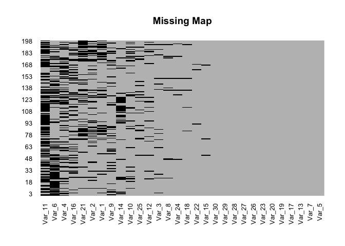

# 数据预处理中的缺失值问题
*Jingye Wang*  *12/4/2017*

声明: 本文档采用知识共享署名-非商业性使用-相同方式共享 4.0
国际许可协议进行许可。[Creative Commons
Attribution-NonCommercial-ShareAlike 4.0 International
License](https://creativecommons.org/licenses/by-nc-sa/4.0/deed.zh).

# 1. 简介
=======

## 1.1 缺失值的分类
----------------

缺失值从数据分布上可被分为三类 (Gelman and Hill 2006, Little and Rubin
(2002)) ：missing completely at random (MCAR), missing at random (MAR),
and missing not at random (MNAR)。

-   完全随机缺失（MCAR）：某一变量缺失值不依赖于其他任何原因的完全随机缺失
-   随机缺失（MAR）：某一变量的缺失与其他变量相关但与该变量本身的数值不相关
-   非随机缺失（NMAR）：某一变量的缺失和该变量本身的数值相关， e.g.,
    仪器的最低检测线：某被检测物质的含量低于该检测线则会产生非随机缺失(left-censored
    missing)

目前大部分填补缺失值的方法都是基于MCAR和MAR，这两种情况也相对比较难区别，因此本文会将这两种情况合并起来讨论。

## 1.2 缺失值的可视化
------------------

我一般拿到数据的第一件事就是用Amelia package (Honaker, King, and
Blackwell 2011) 里面的missmap function看一下缺失值的分布情况。

``` r
require(magrittr)
require(Amelia)
load(file="MVI.RData")
missmap(test_na, col=c("black", "grey"), legend=FALSE, main = 'Missing Map')
```



``` r
# 对于某一变量的缺失值识别可用is.na()
sum(is.na(test_na$Var_1))
```

    ## [1] 43

## 1.3 为什么要对缺失值进行处理
----------------------------

对于MCAR，直接删除缺失的样本一般不会对结果产生偏差，但会减少样本数量；对于非完全随机确实特别是MNAR，如果缺失值较多则会对结果产生很大的偏移。另一方面，很多后续的统计检验要求完整的没有缺失值的数据集,
e.g., principal components analysis (PCA).

# 2. 目前常用的缺失值处理方法
===========================

## 2.1 行删除
----------

### 2.1.1 直接删除有缺失值的样本

最简单粗暴的方法就是直接na.omit()，但是我们可以看到原来198个样本被删到了只剩4个。

``` r
test_na_rm <- na.omit(test_na)
dim(test_na)
```

    ## [1] 198  30

``` r
dim(test_na_rm)
```

    ## [1]  4 30

### 2.1.2 80%法则

80%法则 (Bijlsma et al. 2006)认为，当某一物质的非缺失部分低于总样本量的80%时，建议删除该物质。Modified 80%法则认为， 当某一物质的非缺失部分低于所有生物学亚组的80%时，建议删除该物质。

``` r
# remove variables with missing > 20% 
mis_prop <- sapply(test_na, function(x) sum(is.na(x))/length(x))
var_rm <- names(mis_prop)[mis_prop > 1 - 0.8]
var_rm # remove 7 variables
```

    ## [1] "Var_1"  "Var_2"  "Var_4"  "Var_6"  "Var_11" "Var_16" "Var_21"

``` r
test_na_rm <- test_na[, !colnames(test_na) %in% var_rm]
test_na_rm <- na.omit(test_na_rm)
dim(test_na)
```

    ## [1] 198  30

``` r
dim(test_na_rm)
```

    ## [1] 83 23

去掉7个不符合80%法则的物质以后再用na.omit()删除有缺失的样本，最终的样本数量维持在了83个。

## 2.2 单变量填补
--------------

用单一变量的均值/中位数/二分之一最小值/零值进行补值，这种方法会导致数据分布的偏移，方差偏小，PCA上会看到一条补值导致的直线等问题。

### 2.2.1 MCAR/MAR

对于MCAR/MAR，可以用均值/中位数补值。

``` r
# mean
test_na_mean_imp <- lapply(test_na, function(x) {
    x[is.na(x)] <- mean(x, na.rm = T)
    x
  })
test_na_mean_imp_df <- do.call(cbind.data.frame, test_na_mean_imp)
```

``` r
# median
test_na_median_imp <- lapply(test_na, function(x) {
    x[is.na(x)] <- median(x, na.rm = T)
    x
  })
test_na_median_imp_df <- do.call(cbind.data.frame, test_na_median_imp)
```

### 2.2.2 MNAR

对于left-censored MNAR可以用二分之一最小值/零值进行补值。

``` r
# half of minimum
test_na_hm_imp <- lapply(test_na, function(x) {
    x[is.na(x)] <- min(x, na.rm = T)/2
    x
  })
test_na_hm_imp_df <- do.call(cbind.data.frame, test_na_hm_imp)
```

``` r
# zero
test_na_zero_imp_df <- test_na
test_na_zero_imp_df[is.na(test_na_zero_imp_df)] <- 0
```

## 2.3 多变量填补
--------------

多变量填补的前提是其他变量对于该变量的可预测性，用其他变量作为independent
variable，含有缺失值的该变量作为dependent
variable，建立模型，用模型来预测该变量中的缺失值。

### 2.3.1 MCAR/MAR

目前常用的补值方法大部分都是针对MCAR/MAR的情况：missForest (Stekhoven
and Bühlmann 2012), k-nearest neighbors (kNN) (Troyanskaya et al. 2001),
singular value decomposition (SVD) (T. Hastie, Tibshirani, and Sherlock
1999, Stacklies et al. (2007)), 等等。

``` r
# 请先安装missForest package
require(missForest)
# missForest
test_na_missForest_imp_df <- missForest(test_na)[[1]]
```

    ##   missForest iteration 1 in progress...done!
    ##   missForest iteration 2 in progress...done!
    ##   missForest iteration 3 in progress...done!
    ##   missForest iteration 4 in progress...done!
    ##   missForest iteration 5 in progress...done!

``` r
# 请先安装impute package
require(impute)
# kNN
test_na_kNN_imp_df <-  test_na %>% data.matrix() %>% impute.knn() %>% extract2(1) %>% data.frame()
```

``` r
# 请先安装imputeLCMD package
require(imputeLCMD)
# SVD
SVD_wrapper <- function(data, K = 5) {
  data_sc_res <- scale_recover(data, method = 'scale')
  data_sc <- data_sc_res[[1]]
  data_sc_param <- data_sc_res[[2]]
  result <- data_sc %>% impute.wrapper.SVD(., K = K) %>% 
    scale_recover(., method = 'recover', param_df = data_sc_param) %>% extract2(1)
  return(result)
}
test_na_SVD_imp_df <- SVD_wrapper(test_na) %>% data.frame()
```

### 2.3.2 MNAR

目前对于MNAR的算法开发非常有限，如quantile regression imputation of
left-censored data (QRILC) (Lazar et al. 2016), gibbs sampler based
left-censored missing value imputation approach (GSimp) (Wei et al.
2017).

``` r
# 请先安装imputeLCMD package
require(imputeLCMD)
# QRILC
QRILC_wrapper <- function(data, ...) {
  zero_idx <- which(data == 0, arr.ind = T)
  data_temp <- data
  data_temp[zero_idx] <- NA
  result <- data_temp %>% log() %>% impute.QRILC(., ...) %>% extract2(1) %>% exp()
  result[zero_idx] <- 0
  return(result)
}
test_na_QRILC_imp_df <- QRILC_wrapper(test_na)
```

``` r
# GSimp
source('GSimp.R')
sim_GS_wrapper <- function(data) {
  result <- data %>% multi_impute(., iters_each=50, iters_all=10, initial='qrilc', 
                                  lo=-Inf, hi='min', n_cores=1, imp_model='glmnet_pred')
  return(result$data_imp)
}
test_na_GSimp_imp_df <- sim_GS_wrapper(test_na)
```

    ## Iteration 1 start...end!
    ## Iteration 2 start...end!
    ## Iteration 3 start...end!
    ## Iteration 4 start...end!
    ## Iteration 5 start...end!
    ## Iteration 6 start...end!
    ## Iteration 7 start...end!
    ## Iteration 8 start...end!
    ## Iteration 9 start...end!
    ## Iteration 10 start...end!

Core functions for GSimp are available at:
[GitHub](https://github.com/WandeRum/GSimp).

# 3. 不同补值方法的结果比较
=========================

请参考以下两篇文章： Missing Value Imputation Approach for Mass
Spectrometry-based Metabolomics Data (Wei et al.
2017)， GSimp: A Gibbs sampler based left-censored missing value imputation approach for metabolomics
studies (Wei et al. 2017)。结果显示：在代谢组学的数据中，对于MCAR/MAR的缺失，推荐使用missForest进行补值；
对于left-censored MNAR的缺失，推荐使用GSimp进行补值。 注：以上方法还需在其他类型的数据中进行系统性的比较。

# 4. 缺失值补值可视化软件 – MetImp
================================

我们将以上各种补值方法 (GSimp很快也会添加进去) 做成了一个免费的web-tool:
[MetImp](https://metabolomics.cc.hawaii.edu/software/MetImp/)。

-   Step 1: 上传数据，数据格式请保持和我们网站上example data一致；
    即横行为样本，纵列为物质，第一行为物质名称，第一列为样本名称，第二列为组别信息；
-   Step 2: 选择缺失值是属于MCAR/MAR， 还是MNAR；
-   Step 3: 选择物质删除标准，非缺失部分低于总样本量的百分之多少时删除该物质；
-   Step 4: Run；
-   Step 5: 下载补值后的完整数据。

请cite我们的文章：
- Runmin Wei, Jingye Wang, Mingming Su, Erik Jia, Tianlu Chen, and Yan Ni.
2017. "Missing Value Imputation Approach for Mass Spectrometry-based Metabolomics Data." *Scientific Reports* (under revision).
- Runmin Wei, Jingye Wang, Erik Jia, Tianlu Chen, Yan Ni, and Wei Jia.
2017. “GSimp: A Gibbs sampler based left-censored missing value
imputation approach for metabolomics studies.” *PLOS Computational Biology* (under revision).

# 5. 参考文献
========

Bijlsma, Sabina, Ivana Bobeldijk, Elwin R. Verheij, Raymond Ramaker,
Sunil Kochhar, Ian A. Macdonald, Ben Van Ommen, and Age K. Smilde. 2006.
“Large-scale human metabolomics studies: A strategy for data (pre-)
processing and validation.” *Analytical Chemistry* 78 (2):567–74.
<https://doi.org/10.1021/ac051495j>.

Gelman, Andrew, and Jennifer Hill. 2006. *Data analysis using regression
and multilevel/hierarchical models*.
<https://doi.org/10.2277/0521867061>.

Hastie, Trevor, Robert Tibshirani, and Gavin Sherlock. 1999. “Imputing
missing data for gene expression arrays.” *Technical Report, Division of
Biostatistics, Stanford University*, 1–9.

Honaker, James, Gary King, and Matthew Blackwell. 2011. “AMELIA II : A
Program for Missing Data.” *Journal of Statistical Software* 45
(7):1–54. <https://doi.org/10.1.1.149.9611>.

Lazar, Cosmin, Laurent Gatto, Myriam Ferro, Christophe Bruley, and
Thomas Burger. 2016. “Accounting for the Multiple Natures of Missing
Values in Label-Free Quantitative Proteomics Data Sets to Compare
Imputation Strategies.” *Journal of Proteome Research* 15 (4):1116–25.
<https://doi.org/10.1021/acs.jproteome.5b00981>.

Little, Roderick J a, and Donald B Rubin. 2002. *Statistical Analysis
with Missing Data*. <https://doi.org/10.2307/1533221>.

Stacklies, Wolfram, Henning Redestig, Matthias Scholz, Dirk Walther, and
Joachim Selbig. 2007. “pcaMethods - A bioconductor package providing PCA
methods for incomplete data.” *Bioinformatics* 23 (9):1164–7.
<https://doi.org/10.1093/bioinformatics/btm069>.

Stekhoven, Daniel J., and Peter Bühlmann. 2012.
“Missforest-Non-parametric missing value imputation for mixed-type
data.” *Bioinformatics* 28 (1):112–18.
<https://doi.org/10.1093/bioinformatics/btr597>.

Troyanskaya, O, M Cantor, G Sherlock, P Brown, T Hastie, R Tibshirani, D
Botstein, and R B Altman. 2001. “Missing value estimation methods for
DNA microarrays.” *Bioinformatics (Oxford, England)* 17 (6):520–25.
<https://doi.org/10.1093/bioinformatics/17.6.520>.

Runmin Wei, Jingye Wang, Erik Jia, Tianlu Chen, Yan Ni, and Wei Jia.
2017. “GSimp: A Gibbs sampler based left-censored missing value
imputation approach for metabolomics studies.” *bioRxiv*.
<https://doi.org/10.1101/177410>.

Runmin Wei, Jingye Wang, Mingming Su, Erik Jia, Tianlu Chen, and Yan Ni.
2017. "Missing Value Imputation Approach for Mass Spectrometry-based Metabolomics Data."
*bioRxiv*. <https://doi.org/10.1101/171967>. 
