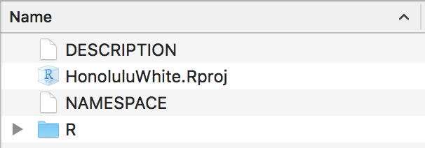
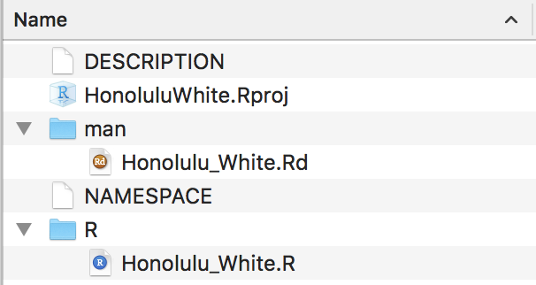

声明: 本文档采用知识共享署名-非商业性使用-相同方式共享 4.0
国际许可协议进行许可。[Creative Commons
Attribution-NonCommercial-ShareAlike 4.0 International
License](https://creativecommons.org/licenses/by-nc-sa/4.0/deed.zh).

1. 前言
=======

最近捣饬了一个R
package，看了一些教程，走了一些弯路，流了一些眼泪，也有了一些心得。
现总结出一个夏威夷小白版本，希望对大家将来开发你们的第一个R
package有所帮助。

2. 正文
=======

2.1 Step One: 安装所需要的package
---------------------------------

    require(devtools)
    devtools::install_github("klutometis/roxygen")
    require(roxygen2)

2.2 Step Two: 建立自己package的目录文件
---------------------------------------

    # 比如说我想把文件夹建在桌面
    setwd("~/Desktop")
    # 比如说新的R Package的名字是HonoluluWhite
    create("HonoluluWhite")

现在，在桌面上就会有一个叫HonoluluWhite的文件夹，打开会看到三个文件和一个名为R的文件夹。

### 2.2.1 DESCRIPTION

DESCRIPTION是整个R package的metadata，用TextEdit或者Sublime
Text编辑都可以，它包括但不局限于以下内容：

    Package: HonoluluWhite
    Title: What the Package Does (one line, title case)
    Version: 0.0.0.9000
    Authors@R: person("First", "Last", email = "first.last@example.com", role = c("aut", "cre"))
    Description: What the package does (one paragraph).
    Depends: R (>= 3.4.1)
    License: What license is it under?
    Encoding: UTF-8
    LazyData: true

**TIPS**: 

-   Title尽量简洁
-   Description最好加上算法的references
-   如果你的package用了别的package里面的function，需要在Imports后面列举出package的名字
-   目前比较常用的开源软件License有GPL-2，GPL-3，MIT等等，我之前上传的时候用了一个半开源的License，CRAN审核后被要求换成一个全开源的
-   关于DESCRIPTION部分更佳详细的解释请看男神的这篇[Hadley Wickham](http://r-pkgs.had.co.nz/description.html)

### 2.2.2 NAMESPACE

NAMESPACE是一个让我很困惑的文件，我的NAMESPACE分成两个部分： 

-   export自己写的function
-   importFrom别的package的function

我理解的这个文件存在的意义是帮助你的新package和其他的package更兼容

### 2.2.3 R文件夹

每个function都需要存在一个独立的.r文件下，example如下：

    #' A Honolulu_White Function
    #'
    #' This function was written by a person with little experieces in R package generating from Honolulu.
    #' @param new Are you a new guy? Defaults to TRUE.
    #' @keywords new
    #' @export
    #' @examples
    #' Honolulu_White()
     
    Honolulu_White <- function(new=TRUE){
        if(new==TRUE){
            print("I am a new guy!")
        }
        else {
            print("I am not a new guy!")
        }
    }

前面的部分是对这个function的描述，内容未来会出现在R中的help部分。

2.3 Step Three: 生成Annotations和更新NAMESPACE
----------------------------------------------

document()会帮助你自动完成这一步。

    setwd("~/Desktop/HonoluluWhite")
    document()

之后，在HonoluluWhite的文件夹中会多出一个文件夹man，里面是function的Annotations。

2.4 Step Four: 写教程--Vignette
------------------------------------

    use_vignette("my-vignette")
    
这部分将来也会出现在R中的help页面里，也是最费时的一部分，但对于推广和应用还是非常重要的一个部分。

2.5 Step Five: 打包成.tar.gz压缩文件
------------------------------------

    build()

2.6 Step Six: 检查
-------------------

在上传CRAN之前需要现在本地检查下package里的错误和不规范的问题，尽量解决所有的warnings,
errors，和notes。

    check()

2.7 Step Seven: 上传CRNA
------------

在[CRAN](https://cran.r-project.org/submit.html)上上传前面的.tar.gz压缩文件即可。
CRAN的效率非常快，基本当天会给回复(不过很可能邮件会在spam里面)，按照邮件里提到的问题修改下minor
issues就可以啦。

3. 最后
=======

最后，推荐一些我觉得值得一看的相关材料：

-   [谢益辉写的：开发 R 程序包之忍者篇](https://cosx.org/2011/05/write-r-packages-like-a-ninja)
-   [官方手册：Writing R Extensions](https://cran.r-project.org/doc/manuals/R-exts.html)
-   [Hadley Wickham：R packages](http://r-pkgs.had.co.nz/)

本文所有内容请戳：https://github.com/elise-is/Statistical_Blog/tree/master/build_R_package

希望你们玩儿的开心。

